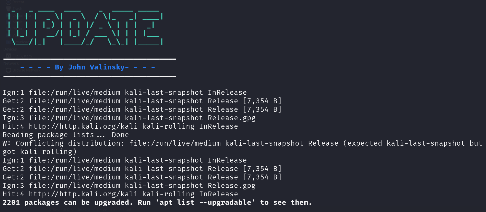

<!-- PROJECT SHIELDS -->




# APT Update & Upgrade Interactive Script

A **simple interactive Bash script** for Debian-based Linux distributions (Ubuntu, Linux Mint, Pop!\_OS, etc.) that allows you to:

-  Update package lists  
-  List upgradeable packages (optional)  
-  Perform a full system upgrade (optional)  
-  Clean unused packages  

---

## Features

- Updates package lists using `apt-get update` and `apt update`  
- Optionally lists upgradeable packages  
- Optionally performs full upgrade, autoclean, and autoremove  
- Interactive prompts for user-friendly experience  

---

## Requirements

- Debian-based Linux distribution (Ubuntu, Linux Mint, Pop!\_OS, etc.)  
- `apt` and `sudo` privileges  

---

## Installation

### Clone the repository

```bash
git clone https://github.com/John-Valinsky/Linux/
```
### Change directory to the Repository
```bash
cd Linux/Update_Upgrade
```
```bash
sudo chmod +x Update.sh
```
```bash
./Update.sh
```
Or Create Script Manually

```bash
nano update.sh
```
### Script
```bash
#!/bin/bash

sudo apt-get update 
sudo apt update

echo -e "\n\nList Upgradeables? (Y/N)"
read -p "> " q

if [ "$q" = 'y' ]; then
    apt list --upgradeable
else
    echo -e "\n\nNo Upgradeable Listing for now!"
fi

echo -e "\nDo you want to Upgrade? (Y/N)"
read -p "> " q2

if [ "$q2" = 'y' ]; then
    sudo apt full-upgrade -y
    sudo apt autoclean
    sudo apt autoremove
else
    echo -e "\nNo Upgrade for now!"
fi
```
### License

MIT License

Copyright (c) 2026 John Valinsky

Permission is hereby granted, free of charge, to any person obtaining a copy
of this software and associated documentation files (the "Software"), to deal
in the Software without restriction, including without limitation the rights
to use, copy, modify, merge, publish, distribute, sublicense, and/or sell
copies of the Software, and to permit persons to whom the Software is
furnished to do so, subject to the following conditions:

The above copyright notice and this permission notice shall be included in all
copies or substantial portions of the Software.

THE SOFTWARE IS PROVIDED "AS IS", WITHOUT WARRANTY OF ANY KIND, EXPRESS OR
IMPLIED, INCLUDING BUT NOT LIMITED TO THE WARRANTIES OF MERCHANTABILITY,
FITNESS FOR A PARTICULAR PURPOSE AND NONINFRINGEMENT. IN NO EVENT SHALL THE
AUTHORS OR COPYRIGHT HOLDERS BE LIABLE FOR ANY CLAIM, DAMAGES OR OTHER
LIABILITY, WHETHER IN AN ACTION OF CONTRACT, TORT OR OTHERWISE, ARISING FROM,
OUT OF OR IN CONNECTION WITH THE SOFTWARE OR THE USE OR OTHER DEALINGS IN THE
SOFTWARE.

